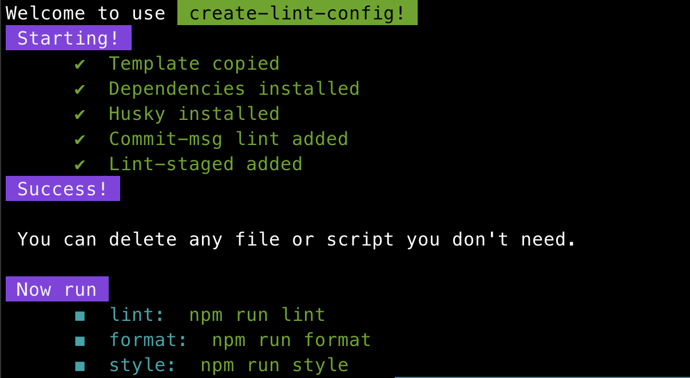

# create-lint-config


[](https://github.com/liruifengv/create-lint-config/pulls)


English | [简体中文](./README.zh-CN.md)

### An easy way to create all lint configuration.

#### A particularly large number of config files distracted us. Our goal is to generate these configurations quickly and easily!

## Usage

Execute the following command at the root of your project:

```bash
# npm
npm create lint-config@latest

# yarn
yarn create lint-config

# pnpm
pnpm create lint-config@latest
```



## Features

- [x] Generate eslint config.
- [x] Generate prettier config.
- [x] Generate stylelint config.
- [x] Generate husky config.
- [x] Generate commitlint config.
- [ ] And more.

## TODO

- Support for selecting templates by passing `-- template` flag.
- Support for more flexible interactive options.

## ISSUE

Please [contact me](https://github.com/liruifengv/create-lint-config/issues) if you encounter any problems.

## Contributing

Contribution guidelines are coming.

You can still give PR, create more template files and support more configurations.

You can also fork this project and turn it into your own scaffolding. This is allowed.

## License

create-lint-config is released under the MIT License. See the bundled
[LICENSE](./LICENSE) file for details.
